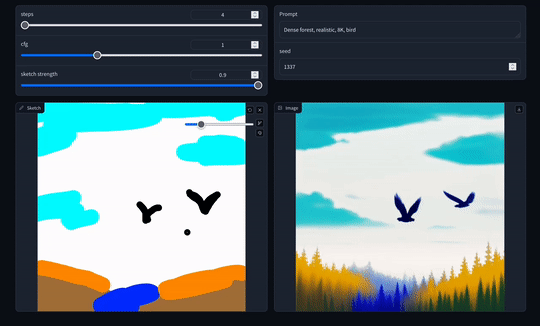

# flowty-realtime-lcm-canvas



This is a realtime sketch to image demo using LCM and the gradio library. 
If you're not familiar with LCM, read about it here - [article on huggingface](https://huggingface.co/blog/lcm_lora).

Thanks to LCM LoRA, you can also use different models by altering the model_id variable in main.py.
The desired effect was for you to be able to draw on one side and see the changes at close to real-time on the other side.

Needless to say, this will perform worse on some GPUs, and better on some GPUs. 4090s usually perform best in the realtime scenario. Share your results!

This was tested on a macbook pro with M2 Max, 30 GPU - 32GB combo, python 3.10. Inference times were tolerable, about 1.2s per render. If you're getting good performance on your machine, feel free to tweak the parameters in order to get better results. You can also change the canvas size to 768 / 1024 in ui.py, depending on your model.

### Setup:
* Setup a venv if you feel like: ```python -m venv env```
  * activate on MacOS: ```source ./env/bin/activate```
  * activate on Windows: ```env\bin\activate```
* Install the requirements: ```pip install -r requirements.txt```
* Run ui.py: 
  * MacOS + mps: ```USE_LOCAL_CUDA=0 python ui.py```
  * Windows + Nvidia GPU: ```python ui.py```

After you run ui.py, models should be downloaded automatically to the models directory. It might take a few minutes depending on your network.
After that gradio will print to the console the url where you can access the ui.


This is a community project from [flowt.ai](https://flowt.ai). If you like it, check us out!

<picture>
 <source media="(prefers-color-scheme: dark)" srcset="logo-dark.svg" height="50">
 <source media="(prefers-color-scheme: light)" srcset="logo.svg" height="50">
 
</picture>
